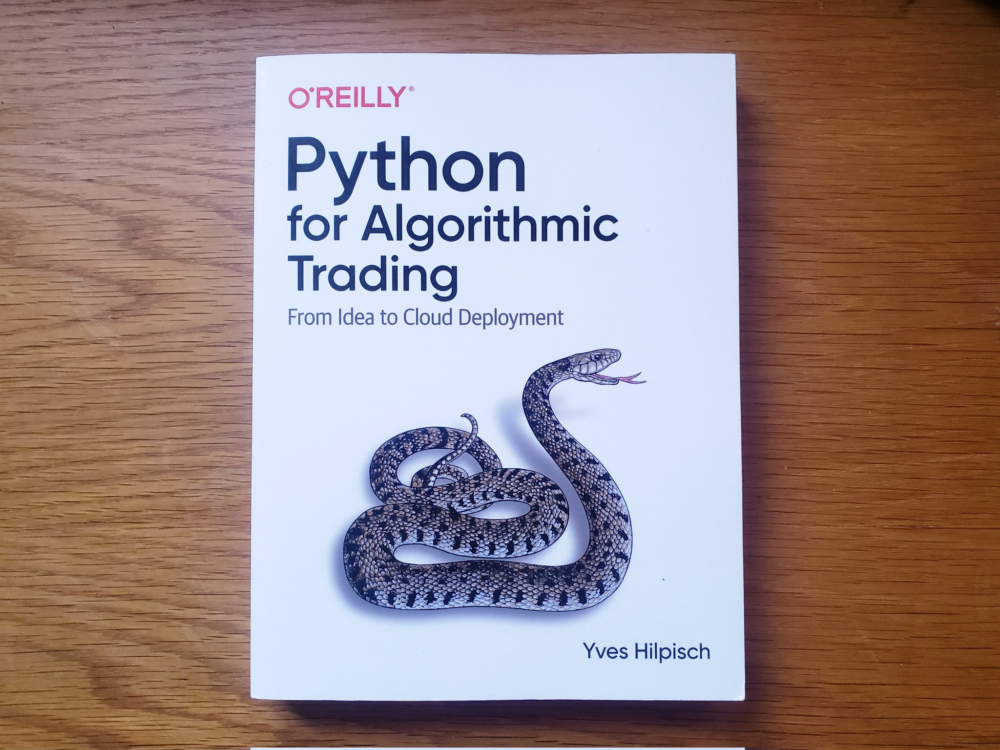

# Code along with Python for Algorithmic Trading

This repository has the sole purpose of learning the principles of algorithmic trading while using a programming language and coding along with the printed book Python for Algorithmic Trading by Yves Hilpisch. It is a personal documentation of moving forward in my learning journey.

*Python for Algorithmic Trading, Yves Hilpisch, O'Reilly, 1st edition November 2020, ISBN-13: 978-1492053354*

## Python for Algorithmic Trading: From Idea to Cloud Deployment

Code examples and most of the explanations I've added as comments are borrowed from Python for Algorithmic Trading by Yves Hilpisch. 

## Resources

Python for Algorithmic Trading, Yves Hilpisch, O'Reilly, November 2020.